Did I forget her birthday?...

Entry 1:

Uhh im trying to finish this keyboard in roughly under 1 day so i can get to completing other ysws's Also I have NO ambition on actually making the keyboard. So if any of you are reading this, feel free to make it using this as a guide or just make it using this repo.

Lets start!

I'm making the scematic, since its an iso, it uses 6x keys. Also this is not my first keyboard that I'm making so I'm pretty chill rn. Almost all my other keyboards turned out thick asf, so this time Ima slim it down - Heavily.

I'll also make an entry every big occasion so that the time can be calculated roughly accurately. 

Time spent : 0h

Entry 2:

The pcb and schematic are done, uhh its been like 4 hours since i wrote my first entry, but I honestly only done 3 hours of actual work.
                                     
Uhm ill link some images down there v v

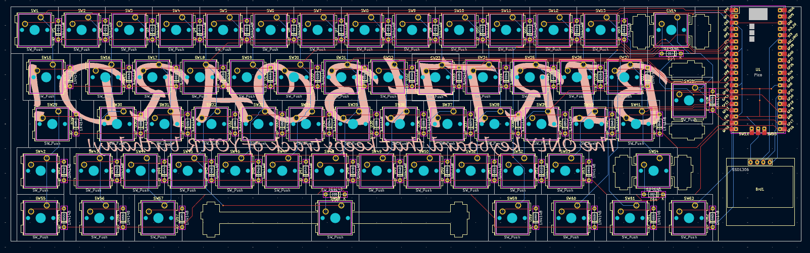
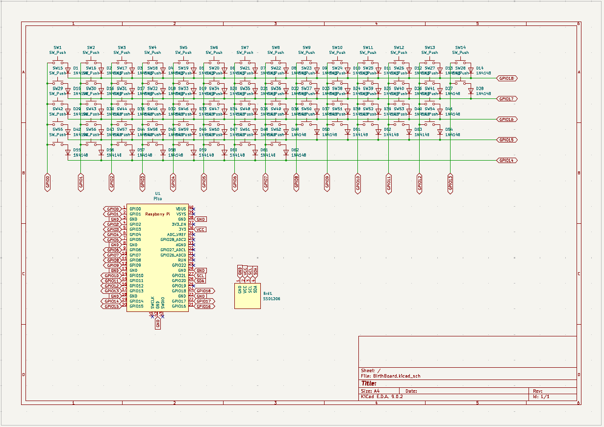

Time Spent : 3h

Entry 3: 

I spent 1 hour reseaching parts and grabbing cad files, then i spent another 2 hours actually putting them onto the pcb so that it wouldnt be a hassle later on. Eventually I made this vv

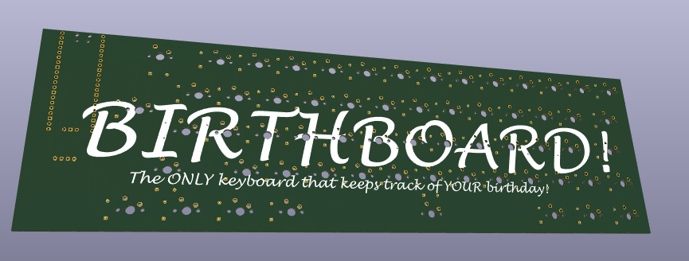
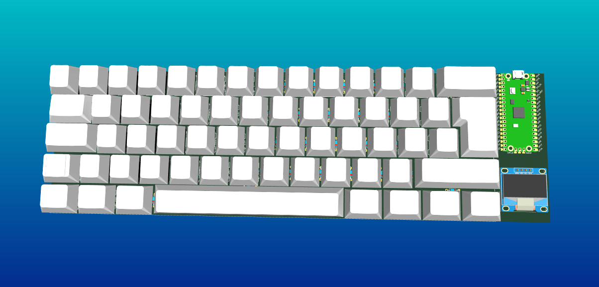
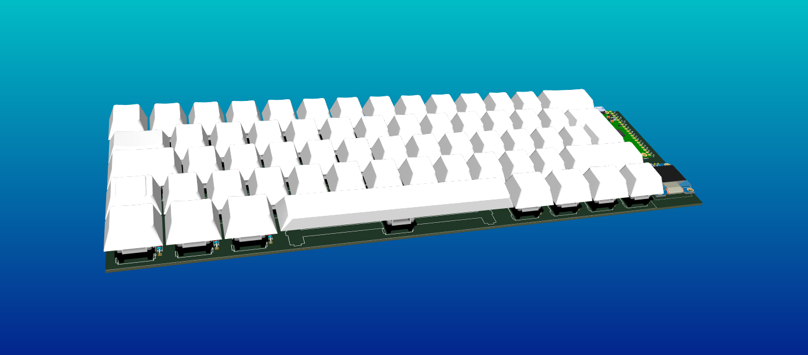

Time spent: 3h

Entry 4: I completed the case, It looks pretty awesome. Nothing like I made before. I feel kinda sad that I probably won't ever be able to make something like that. But then again. Making things like the helps me to become a better cadder and pcb maker!
Here are some images of the case. 

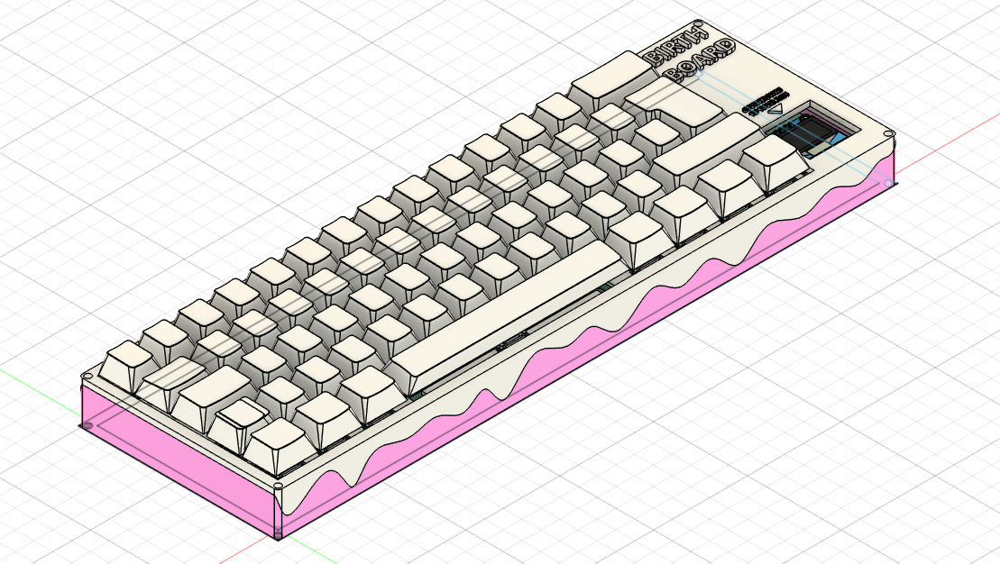
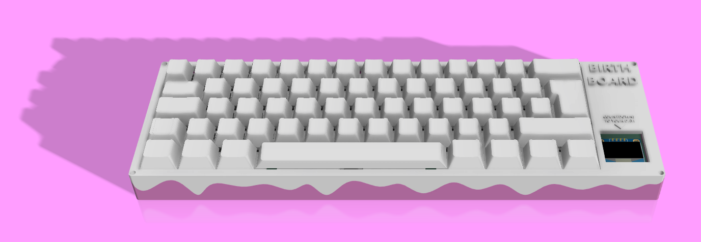
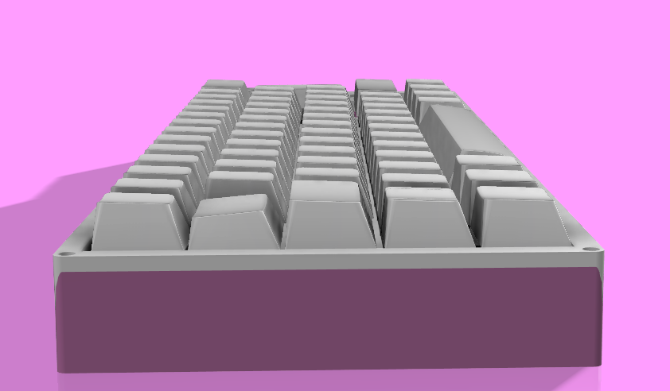
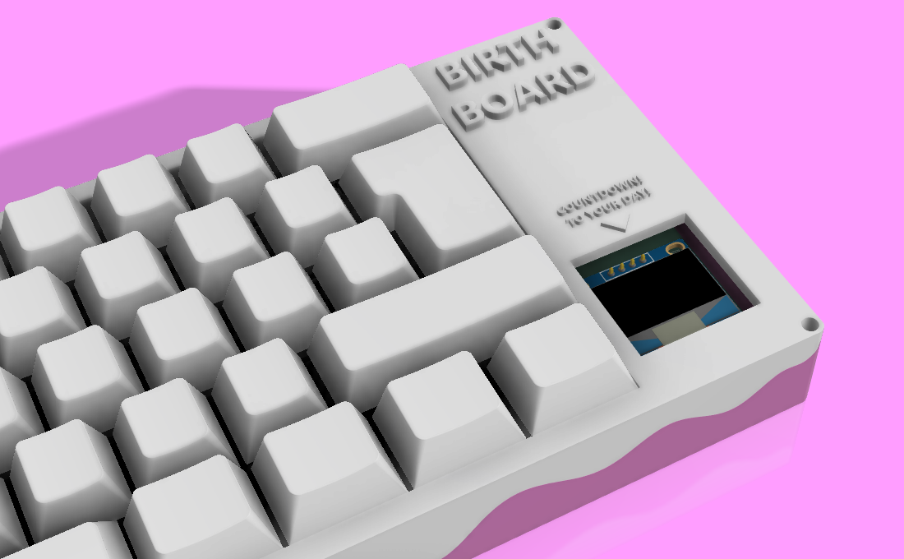
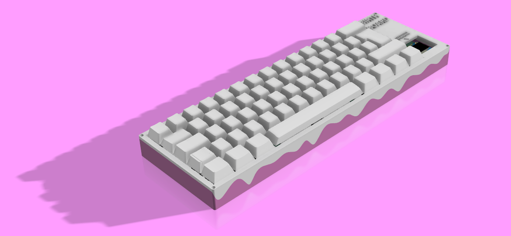
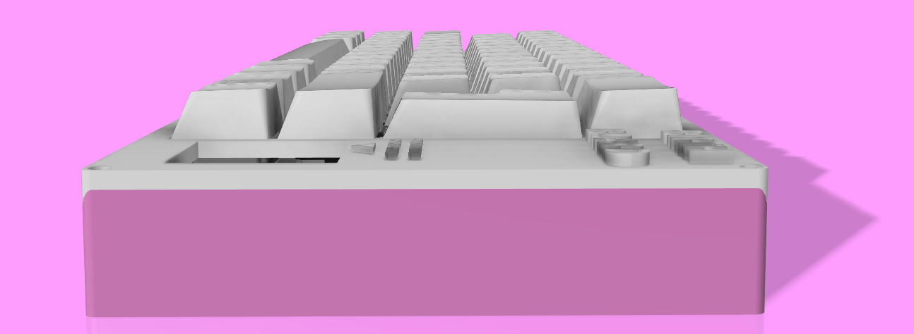
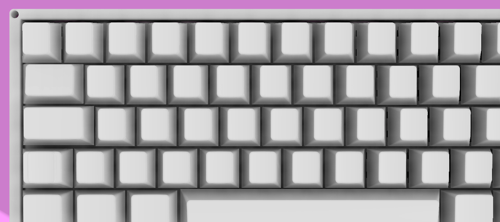

Time spent: 4h

Entry 5: 

I forgot to mention.. I spent 1 hour making firmware for the keyboard. I used arduino since I am relatively comfortable with it. But you can use kmk or qmk if you want.

Time taken: 1h

Well.. That's the end.. I really hope you enjoyed it!
